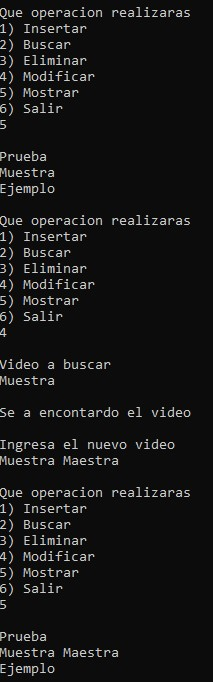

# Circular Doubly Linked List CRUD

A console-based CRUD (Create, Read, Update, Delete) application implemented using a circular doubly linked list in C.

## Overview

This project demonstrates the implementation of a circular doubly linked list through an interactive console application.

The application performs CRUD operations while maintaining a circular doubly linked structure, allowing bidirectional traversal between nodes and continuous navigation through the list.

Although video titles are used as sample data, the primary objective of the project is to demonstrate the implementation and manipulation of an advanced linked data structure using dynamic memory allocation.

## Features

- Circular doubly linked list implementation.
- CRUD operations (Create, Read, Update, Delete).
- Bidirectional node traversal.
- Circular node connections.
- Dynamic memory allocation.
- Interactive console interface.
- String-based record management.

## Screenshot



## Technologies

- C
- Standard C Library
- String Library (`string.h`)
- Dev-C++

## Project Structure

```text
.
├── assets
│   └── images
│       └── circular_doubly_linked_list_crud_demo.jpg
├── circular_doubly_linked_list_crud.cpp
├── README.md
├── LICENSE
└── .gitignore
```

## How to Compile

Using GCC:

```bash
g++ circular_doubly_linked_list_crud.cpp -o circular_doubly_linked_list_crud
```

## How to Run

Windows

```bash
circular_doubly_linked_list_crud.exe
```

Linux/macOS

```bash
./circular_doubly_linked_list_crud
```

## Concepts Demonstrated

- Circular doubly linked lists
- CRUD operations
- Bidirectional traversal
- Dynamic memory allocation
- Pointer manipulation
- Circular data structures
- String handling
- Menu-driven programming

## Future Improvements

- Add reverse traversal functionality.
- Validate duplicate records before insertion.
- Save and load records from files.
- Improve input validation.
- Refactor the implementation into multiple source files.
- Release all allocated memory before program termination.

## License

This project is licensed under the MIT License.

## Author

Luis Alva
